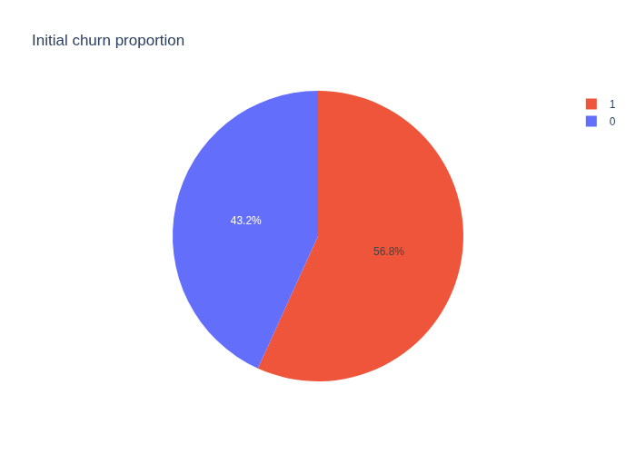

# data-analysis-with-python
_**Jornada Python 2026 [AULA 2] | Hashtag Programação**_  
Developed project during the "Jornada Python" event, with the supports of instructor João Paulo Rodrigues de Lira.

---
## 📋️ Project
You have been hired by a company with over 800,000 customers for a Data project.

> Recently, the company noticed that most of its customer base consists of inactive clients who have already canceled the service.

To improve results, the company wants to **understand the primary reasons for these cancellations** and identify the **most effective actions to reduce churn**.

---
### 🧾 Initial Diagnosis
This chart shows the initial churn rate:

---
## More materials
| Links | Description |
| :--- | :--- |
| [📖 Class](https://www.youtube.com/watch?v=0c2AfijcWb0&t=7013s) | Youtube live |
| [📚️ Materials](https://drive.google.com/drive/folders/1uDesZePdkhiraJmiyeZ-w5tfc8XsNYFZ) | Materials |